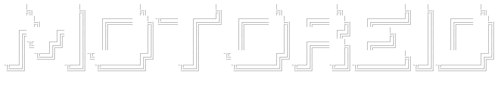

<br>
[](https://huggingface.co/johnamit/motoreid)
&nbsp;&nbsp;&nbsp;
[](https://app.roboflow.com/amitjohnworkspace/motogp-team-detection/models)
&nbsp;&nbsp;&nbsp;
[](https://drive.google.com/drive/folders/PLACEHOLDER_DEMO_VIDEOS)


MotoReID is a computer vision pipeline for MotoGP bike team detection, tracking, and re-identification from race footage. It uses YOLOv8 for detection, official Ultralytics BoT-SORT + ReID for tracking, and DINOv3 embeddings with a lightweight classifier for team identity. It targets key high-speed sports CV challenges: stable team recognition through heavy occlusions, rapid camera cuts, and motion blur.

<p>
  <a href="#overview"></a>
  <a href="#dataset--annotation"></a>
  <a href="#training-pipeline"></a>
  <a href="#setup"></a>
  <a href="#usage"></a>
  <a href="#performance"></a>
  <a href="#pipeline"></a>
  <a href="#teams"></a>
  <a href="#citation"></a>
  <a href="#license"></a>
</p>


## Overview

MotoReID runs a multi-stage perception pipeline on race video:
- **Detection (YOLOv8):** localizes motorcycles frame by frame.
- **Tracking (BoT-SORT + ReID):** assigns short-term track IDs using the official Ultralytics tracker path.
- **Feature Extraction (DINOv3 ViT-S/16):** produces semantic embeddings from tracked bike crops.
- **Team Classification (Logistic Regression):** predicts team identity from DINO features.

This design combines strong detection, official tracking, and lightweight identity classification for practical sports-video analytics.


## Dataset & Annotation
This project uses a manually curated MotoGP dataset built from race broadcast footage.
- **Source:** 1080p/60fps highlight footage.
- **Frame extraction:** OpenCV script via `src/data/extract_frames.py`.
- **Annotation platform:** Manually annotated with [Roboflow](https://app.roboflow.com/amitjohnworkspace/motogp-team-detection/models).
- **Detection set:** 501 images with 1 class (`motorbikes`), 1,583 motorcycle box annotations, and 97 null/background images.
- **Identity set:** 668 curated team crops across 11 teams.
- **Challenging views:** rear-view, lean-angle, motion-blur, and occluded bike samples are included within the curated team crop folders to improve difficult-view robustness.


## Training Pipeline
The training workflow is:
1. Download race highlight videos.
2. Extract representative frames from race videos.
3. Train/fine-tune YOLOv8 for motorcycle detection.
4. Auto-harvest bike crops with detector-assisted extraction.
5. Manually clean and sort crops into team folders.
6. Extract DINOv3 embeddings and train the team classifier.
7. Run full inference with BoT-SORT tracking and team classification.


## Setup

### Requirements
- Python 3.10+
- PyTorch 2.4+
- CUDA 12.x (recommended)
- Linux (tested on Ubuntu 22.04)


### Install
```bash
git clone https://github.com/johnamit/motoreid.git
cd motoreid

conda create -n motoreid_env python=3.10 -y
conda activate motoreid_env
pip install -r requirements.txt
```

### DINOv3 dependency
This project uses DINOv3, which requires a local clone of the official repository:

```bash
# Clone DINOv3 into the project root
git clone https://github.com/facebookresearch/dinov3.git

# Download Pre-trained Weights (ViT-Small)
mkdir -p models/DINO
wget -O models/DINO/dinov3_vits16_pretrain_lvd1689m.pth \
    https://huggingface.co/facebook/dinov3-vits16-pretrain-lvd1689m/resolve/main/dinov3_vits16_pretrain_lvd1689m.pth
```

### MotoReID model artifacts
Download the trained detector and classifier from Hugging Face and place them at the paths expected by the inference scripts:

```bash
mkdir -p models/YOLO/motogp_yolov8m/weights models/classifier

wget -O models/YOLO/motogp_yolov8m/weights/best.pt \
    https://huggingface.co/johnamit/motoreid/resolve/main/motogp_yolov8m_detector.pt

wget -O models/classifier/dinov3_identity_model.pkl \
    https://huggingface.co/johnamit/motoreid/resolve/main/dinov3_team_classifier.pkl
```


## Usage

### Download race clips
```bash
bash src/scripts/download_race_highlights.sh
```

### Full pipeline (detection + tracking + classification)

Run the complete pipeline. This script initializes the models, processes the video with BoT-SORT tracking, and outputs annotated results.

```bash
python src/inference/main.py \
  --video data/race_highlights/test/grandprix/2025_australian_gp_sprint.mp4 \
  --output results/pipeline/2025_australian_gp_sprint_full_pipeline.mp4 \
  --yolo_weights models/YOLO/motogp_yolov8m/weights/best.pt \
  --classifier_path models/classifier/dinov3_identity_model.pkl \
  --dino_weights models/DINO/dinov3_vits16_pretrain_lvd1689m.pth \
  --tracker models/YOLO/trackers/botsort_reid.yaml
```

### YOLO-Only Detection

For simple detection without team classification:

```bash
python src/inference/detector.py \
    --video data/race_highlights/test/grandprix/2025_british_gp.mp4 \
    --output results/yolo_detection/2025_british_gp_yolov8m.mp4
```

### Train Team Classifier

If you add new images to data/teams/, retrain the identity head:

```bash
python src/training/train_identity_model.py \
    --data_dir data/teams \
    --model_dir models/classifier \
    --dino_weights models/DINO/dinov3_vits16_pretrain_lvd1689m.pth \
    --batch_size 64
```

### Extract Frames from Video

```bash
python src/data/extract_frames.py \
    --input data/race_highlights/train \
    --outdir data/race_frames \
    --interval 150
```

### Harvest Bike Crops

Auto-crop detected bike regions for building the identity dataset:

```bash
python src/data/harvest_bikes.py \
    --video data/race_highlights/train/2025_qatar_gp.mp4 \
    --outdir data/teams/unlabeled \
    --gp qatar \
    --yolo_weights models/YOLO/motogp_yolov8m/weights/best.pt
```


## Performance

### Detector Performance
Current trained detector runs on the validation split:

| Model   | Best Epoch | Precision | Recall |  mAP50 | mAP50-95 |
| ------- | ---------: | --------: | -----: | -----: | -------: |
| YOLOv8n |         89 |    0.9398 | 0.8974 | 0.9404 |   0.7659 |
| YOLOv8m |         92 |    0.9618 | 0.8910 | 0.9459 |   0.7735 |
| YOLOv8l |        100 |    0.9309 | 0.9039 | 0.9386 |   0.7496 |


### Team Classifier Performance

| Model                        | Crops | Teams | Accuracy | Macro F1 | Weighted F1 |
| ---------------------------- | ----: | ----: | -------: | -------: | ----------: |
| DINOv3 + Logistic Regression |   668 |    11 |     0.90 |     0.89 |        0.90 |


## Teams

The system identifies all 11 teams from the 2025 MotoGP grid:
```python
TEAM_COLORS = {
    'aprilia_factory':    (0, 255, 0),      # Green
    'aprilia_trackhouse': (0, 200, 100),    # Teal
    'ducati_lenovo':      (0, 0, 255),      # Red
    'ducati_gresini':     (0, 100, 255),    # Orange-Red
    'ducati_vr46':        (0, 255, 255),    # Yellow
    'honda_hrc':          (0, 0, 0),        # Black
    'honda_lcr':          (200, 200, 200),  # Light Gray
    'ktm_factory':        (0, 165, 255),    # Orange
    'ktm_tech3':          (0, 140, 255),    # Dark Orange
    'yamaha_monster':     (255, 0, 0),      # Blue
    'yamaha_pramac':      (255, 100, 100),  # Light Blue
}
```


## Citation

**DinoV3:**
```bibtex
@article{simeoni2025dinov3,
  title={Dinov3},
  author={Sim{\'e}oni, Oriane and Vo, Huy V and Seitzer, Maximilian and Baldassarre, Federico and Oquab, Maxime and Jose, Cijo and Khalidov, Vasil and Szafraniec, Marc and Yi, Seungeun and Ramamonjisoa, Micha{\"e}l and others},
  journal={arXiv preprint arXiv:2508.10104},
  year={2025}
}
```

**YOLOV8:**
```bibtex
@software{yolov8_ultralytics,
  author = {Glenn Jocher and Ayush Chaurasia and Jing Qiu},
  title = {Ultralytics YOLOv8},
  version = {8.0.0},
  year = {2023},
  url = {https://github.com/ultralytics/ultralytics},
  orcid = {0000-0001-5950-6979, 0000-0002-7603-6750, 0000-0003-3783-7069},
  license = {AGPL-3.0}
}
```

**BoT-SORT**
```bibtex
@article{aharon2022bot,
  title={BoT-SORT: Robust associations multi-pedestrian tracking},
  author={Aharon, Nir and Orfaig, Roy and Bobrovsky, Ben-Zion},
  journal={arXiv preprint arXiv:2206.14651},
  year={2022}
}
```


## License

This project is released under the MIT License

Note: MotoGP broadcast footage is copyrighted material. This project is intended for educational and research purposes only. All models were trained on fair-use excerpts for non-commercial analysis.